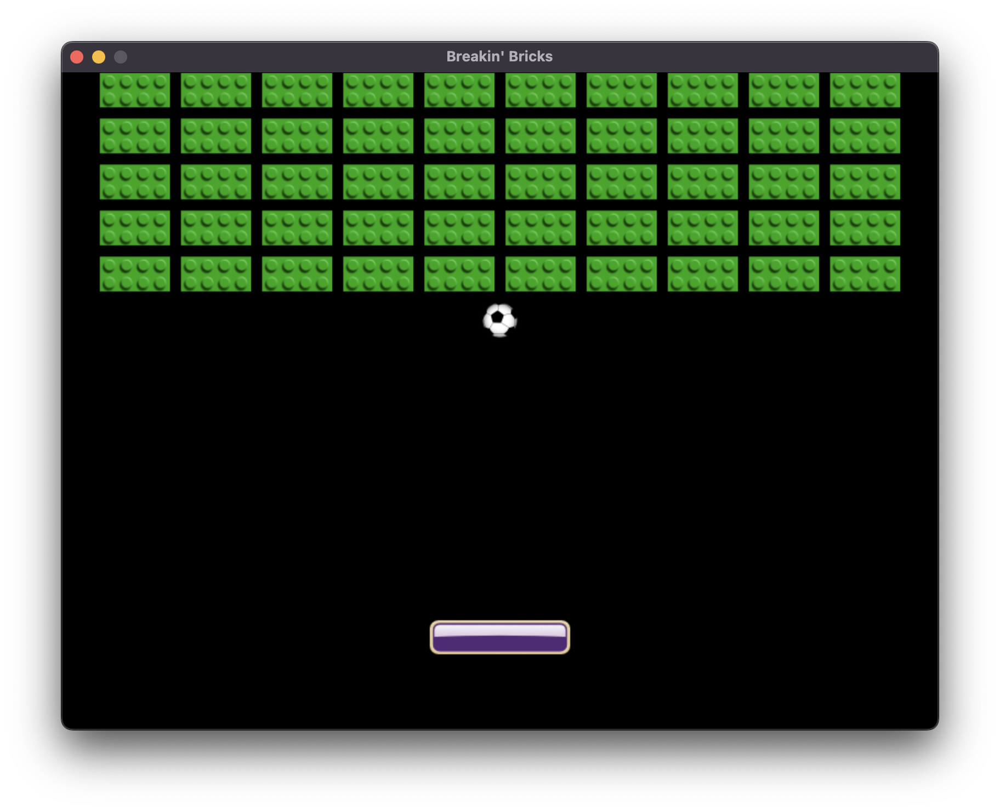
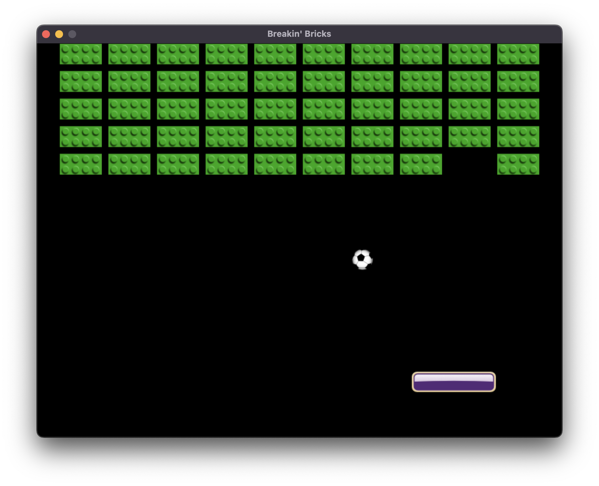
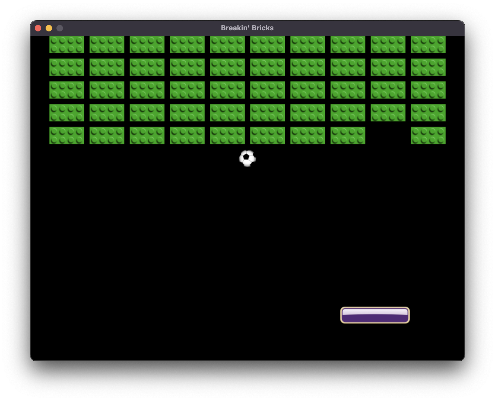
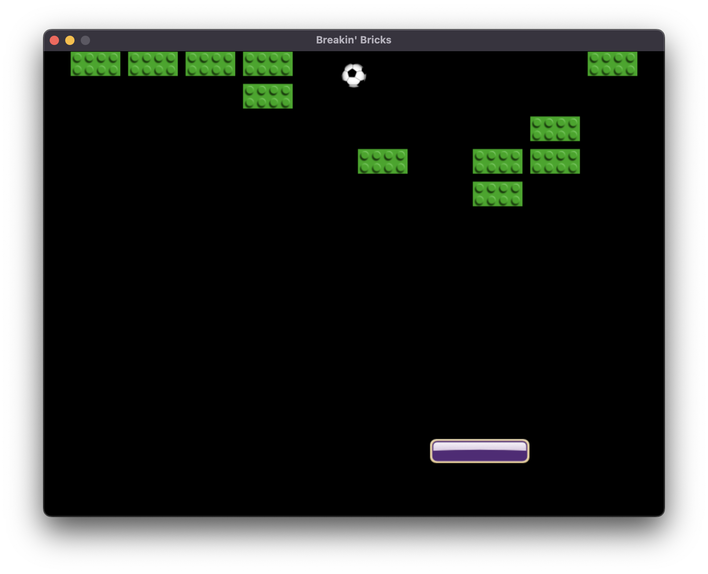
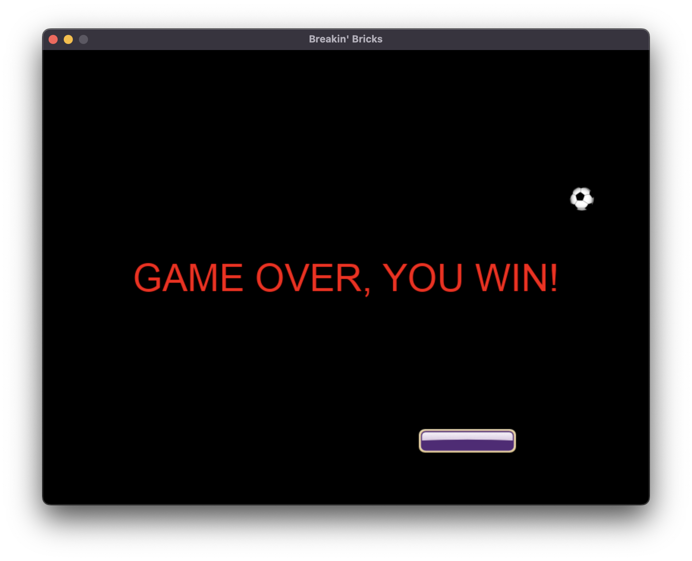

# Breakin' Bricks game

The following is the recreation of the classic Breakin' Bricks game with python using pygame, and the following is a game walkthrough. The game will initially look like that:

## Starting the game:

The ball and the paddle are initially in the center of the screen. The space key should be pressed in order to get the game running, then the ball will move downward towards the paddle. 

## The game's mechanics:

### Moving the paddle:

The user moves the paddle with the left and right keys on the keyboard.

### Bouncing the ball off the paddle:

If the ball hits the left half of the paddle, then the ball bounces off it in the left direction, and if it hits the right half, then it bounces to the right. If the ball misses the paddle, the ball position will be reset to the default initial postion.

### Game difficulty
To gradually increase the difficulty of the game, the ball's speed will increase by a tiny fraction each time it hits the paddle. The game keeps going for as long as there is bricks left, and the longer time the user takes, the harder it gets.

### Game end:

When the user finishes hitting all the bricks, the game will end and a display message will appear. 

Each section in the code is labeled with a relative comment and the game mainly runs within the while loop. To exit the game the user must click on quit.
The end :)

